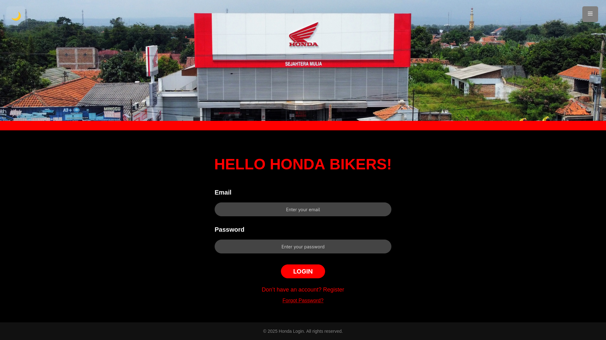
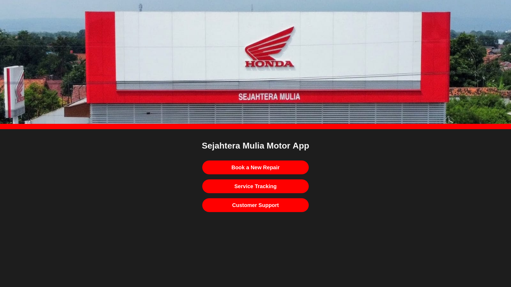
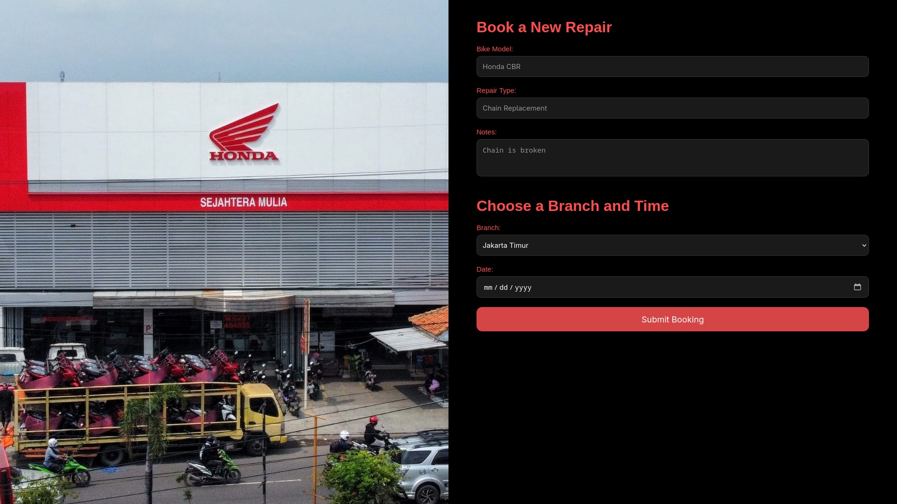
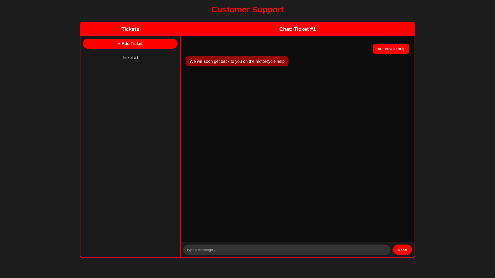

# Sejahtera Mulia Motor App

## Project Overview

[Sejahtera Mulia Motor App]((https://dmr-uni-projects-assignments.github.io/HCI-FinalProject-MotorApp/)) is a webapp used for motorcycle repair bookings at the **Sejahtera Mulia Motor** shop. The app allows customers to schedule service appointments easily and check their booking status. Furthermore, they could open support tickets with Customer Service.

## Technologies Used

* **HTML** – Page structure and content
* **CSS** – Styling and layout
* **JavaScript** – Interactivity and basic logic

## Features

* Book motorcycle repair and maintenance services online
* Schedule service appointments conveniently
* View and check the status of existing bookings
* Open support tickets to communicate with Customer Service
* Simple and intuitive user interface for customers
* Light and dark mode for comfort in low light
* Account login and registration system with password recovery

## Screenshots

| Screenshot                   |
| - |
|  |
|  |
|  |
|  |
|  |

## How to Run the Project

1. Clone the project: `git clone https://github.com/dmr-uni-projects-assignments/HCI-FinalProject-MotorApp.git`
2. Open `index.html` in a web browser

**OR**, you can visit the live GitHub Pages site [here](https://dmr-uni-projects-assignments.github.io/HCI-FinalProject-MotorApp/)

## Notes

* This project is ONLY THE FRONTEND!
* Data persistence and backend services are not included

## Author
1. Aliansky Winston Viando: 2902708224
2. Cecilia Handoko: 2902717632
3. Samuel Reagan Purnama: 2902671833
